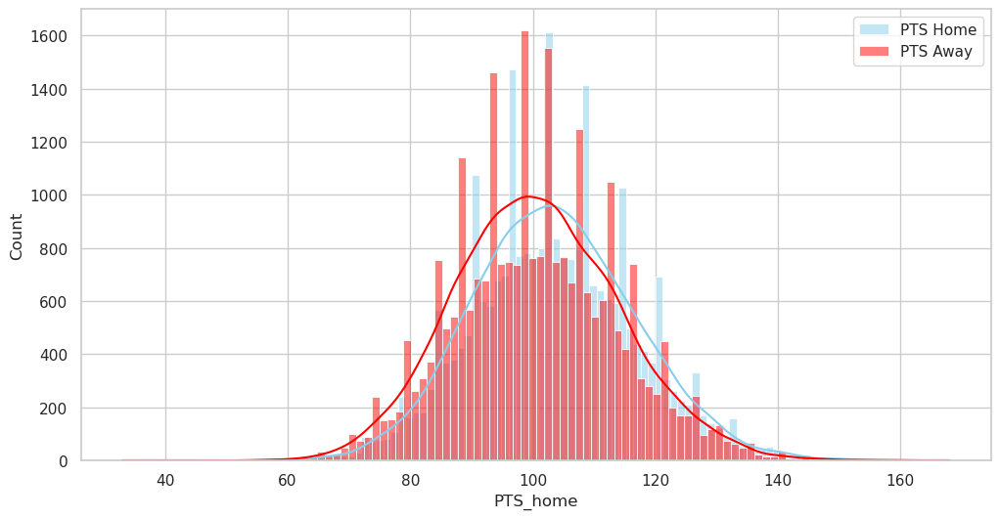

# NBA Stats Insight Project 🏀📈

## Introduction 🌟

Welcome to the NBA Stats Insight Project, the ultimate exploration into the enthralling world of basketball statistics. Here, we unravel the stories the data tells, from the sweat on the court to the celebrations in the stands. Our mission is to decode complex datasets to reveal the game's underlying narratives, trends, and forecasts.

## What We've Done So Far 🛠️

Our journey has commenced with an extensive collection of datasets, diving deep into games, player details, team rankings, and beyond. It's a beginning that sets the stage for a saga of statistical storytelling.

- **Data Exploration**: We've loaded comprehensive datasets capturing a wealth of information, from player performances to game outcomes.
- **Statistical Transformations**: By cleaning and transforming the data, we've laid a clean canvas ready for advanced analytics.
- **Performance Metrics**: We delved into the heart of the game, scrutinizing points and rebounds, revealing the heroes in numbers.
- **Visual Storytelling**: Through the power of `matplotlib` and `seaborn`, we've painted pictures of our findings, displaying the distribution of home and away points, and spotlighting the top teams and players.

## Upcoming Attractions 🚀

This is just the tip-off. Here's a sneak peek into our playbook for future strategies:

1. **Interactive Dashboards**: At the top of our list is the creation of dynamic dashboards, crafting an immersive experience where fans can navigate the tides of data with the flick of a finger.

2. **Player Analytics**: A close second is our focus on the athletes, analyzing their efficiency, longevity, and impact, translating their sweat into our charts.

3. **Advanced Statistical Models**: We aim to build sophisticated models that can predict outcomes, player trajectories, and perhaps even the next game-changer in the league.

4. **Expanding the Dataset**: We plan to broaden our horizons by integrating more data, covering more ground, and capturing the essence of every dribble and dunk.

## Contribute to the Legacy 🏛️

We invite you to be a part of this legacy. Contribute your analyses, share your insights, and let's collaborate to make the NBA Stats Insight Project a beacon for basketball analytics.

## Stay in the Loop 🔄

Don't miss a beat. Star and watch this repository for updates, releases, and breakthroughs. Your thoughts, feedback, and slam dunks of wisdom are always welcome.

## Acknowledgments 🙌

Big shout-out to the NBA and all data providers for their open data policies, making this all possible. Here's to the statisticians who record every point and the players who make every stat count.

---

Join us as we crunch numbers, break records, and uncover the essence of basketball, one stat at a time. 📊🏆

